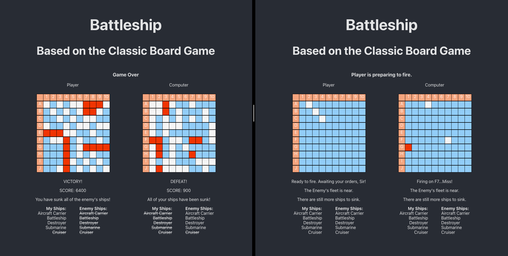

<div align="center" >

# BattleShip

## Based on The Classic Board Game



</div>

</br>

### Current location

- [https://th-battleship.herokuapp.com/](https://th-battleship.herokuapp.com/)
- Heroku free-tier hosting, since it is free the app automatically shuts down after 30 minutes of non-use, so, it will take a few seconds to load when you first visit the page.
<br>

- This is NOT a UI / UX focused app, it is not responsive to screen size, WYSIWYG.
<br>

- [src/Logic/shipPlacer.js](https://github.com/thomHayner/battleship-mini-app/blob/master/src/Logic/shipPlacer.js) has a Recursive Function.
<br>

- There is an additional conditional recursion that will sometimes prevent the computer from firing on the same tile multiple times during the same game (95% of the time the function will recurse and pick a new tile to fire upon, the other 5% of the time it will allow the computer to waste it's turn 'accidentally').  It currently happens between two files, App.js and XXXXX.js
<br>

- [src/Logic/computerTurn.js](https://github.com/thomHayner/battleship-mini-app/blob/master/src/Logic/computerTurn.js) has an Asynchronous Promise (the promise is consumed in the function fireControllHandler() in [src/App.js](https://github.com/thomHayner/battleship-mini-app/blob/master/src/App.js), error handling is done correctly and apropriately.
<br>

- The main component, [src/App.js](https://github.com/thomHayner/battleship-mini-app/blob/master/src/App.js), is a statefull class component which uses the super constructor, all of the other components and elements are stateless functional components.
<br>

- Components are destructured, Elements use 'props', mostly just because it's an organized way to present a variety of techniques.  The spread operator is used throughout, in App.js is used for setting nested state, and in Square.js it is used as a rest operator.  Checkboard.js is a pure function and also a switch statement in it.  
<br>

- There are also pure functions and higher order functions throughout the project.
<br>

### Tech Stack
<details>
  <summary>Front End</summary>

- JavaScript
- React
- CSS

</details>

<br>

### Background

<p>
  This was originally a one day app challenge.  The gameboard, scoreboards and announcements all rendered and functioned correctly for gameplay, but I was not able to implement 'board selection' or 'single player' features in time so the ships were not movable, the board configuration (where the ships were placed) never changed, and you needed two people (or a single player clicking on both boards).
</p>

<p>
  I have since done some work to refactor and compartmentalize the app.  I also added a randomizer for the board configurations and a 'computer player' as an automated opponent.
  I plan to add player 'board selection', maybe using click handlers or possibly react-beautiful-dnd.<br>
</p>

<p>
  The app is mostly JavaScript, with a little bit of React to make the UI.  As I went through the refactoring process and started adding features I realized that this app was a great opportunity to show fundamentals such as classes, asyncronous operations, and recursion, as well as newer concepts like destructuring and the spread operator.  Thus, even though it is a simple app, I decided to make it a portfolio piece.
</p>

<p>
  Since there is no back end, I decided to just host it on Heroku as a front end only app.  I could try and make it full stack, possibly by making some sort of arcade game style score board component that saves high scores, or a way to save a game in the middle and then come back to it later, however, I doubt that many people will ever play this, so I will probably just leave it as a portfolio project displaying an app with JavaScript and React's super constructor method.
</p>

<br>

### Deployment
<details>
  <summary>Heroku Quick Deploy</summary>

  1. Check if Heroku CLI is installed, take necessary action, then login.
  ```shell
  heroku --version
  ```
  Installed, update, and/or proceed.

  <br>

  2. Log in to Heroku through the CLI / browser
  ```shell
  heroku login
  ```
  Follow prompts and log in.

  <br>

  3. Create your Heruko App through the command line
  [Heroku Docs / C-R-A Runtime QuickDeploy Instructions](https://blog.heroku.com/deploying-react-with-zero-configuration)
  ```shell
  heroku create -b https://github.com/mars/create-react-app-buildpack.git
  git add .
  git commit -m "react-create-app on Heroku"
  git push heroku master
  heroku open
  ```

</details>

<br>

### CI / CD
<details>
  <summary>Heroku / Git Integration</summary>

  - no major CI / CD at this time
  - can be set up with webhook to auto-update with push to master on github
  - this is an intermittent use app and likely won't need much maintainence, so manual will provide regular interaction / practice with maintainence processes
  - manual deployment through CLI or [Heroku](Heroku.com) dashboard is currently necessary
    <details>
      <summary>CLI</summary>

      - In your terminal
      ```shell
      git push heroku master
      heroku open
      ```

    </details>

    <details>
      <summary>Heroku Dashboard</summary>

      - [Heroku](Heroku.com)
      - log in
      - select your app
      - click deploy
      - scroll down to bottom and click "Manual Deploy" button

    </details>

</details>